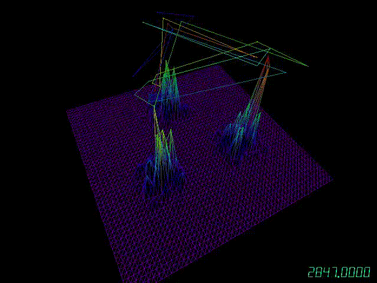
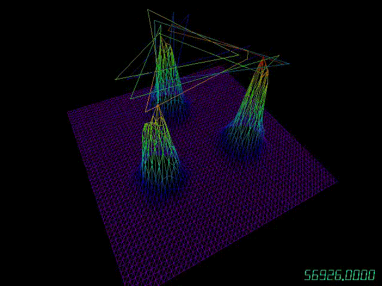
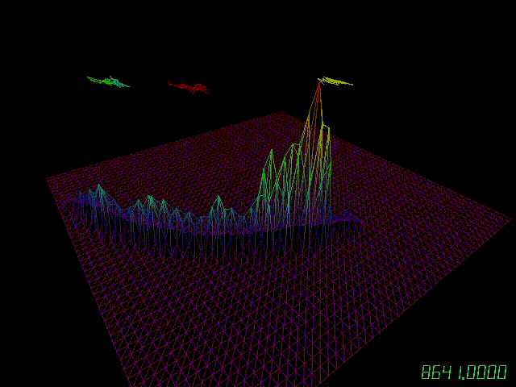
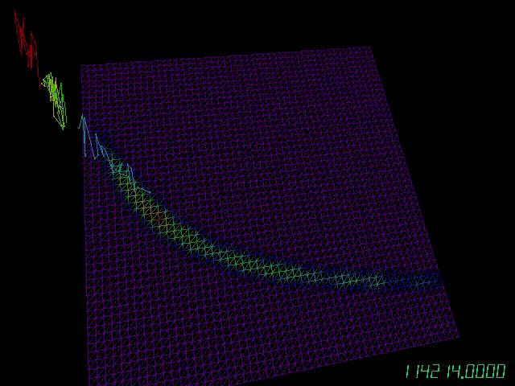

# MCMC Visualization

### Authors
* Dustin Tran \<dtran@g.harvard.edu\>
* Ye Kuang \<yekuang@g.harvard.edu\>

## Description
mcmc-viz is a 3D visualization tool for examining [Markov chain Monte
Carlo](http://en.wikipedia.org/wiki/Markov_chain_Monte_Carlo) (MCMC) methods for
parameter estimation of Bayesian models. It visualizes the performance of MCMC
methods as they run in real time, and it provides insight into the geometry of
their state space.

### Features
* Visualizes the empirical posterior distribution.
* Visualizes the trajectory of the latest 25 sampled points.
* Supports user-defined sampling functions (proposal) and models (posterior).
* Supports any number of parameters; for visualization, we project to the first
  two dimensions of the parameters.
* Keyboard shortcuts
  * `F`: Toggle between a 3D posterior surface and a 2D heatmap
    (contour plot).
  * `T`: Cycle between three display options in the bottom-right corner of the
    viewer—the number of iterations, the acceptance rate, and no display.

## Examples

### Mixture model of normals
`SimpleProblem.hpp` is a mixture of three bivariate normal distributions
centered at the three vertices of an equilateral triangle. We apply
[Metropolis-Hastings](http://en.wikipedia.org/wiki/Metropolis–Hastings_algorithm),
where the proposal function is a bivariate normal distribution whose center is
at the center of the triangle.




### Hierarchical model for binomial
`Waterbuck.hpp` follows Raftery (1988). It models data about waterbucks
using the distribution `Binomial(N,p)`, where both `N` and `p` are unknown, and
applies a noninformative prior on `(N,p)` proportional to `1/N`.

In this example, we use two univariate normal distributions as the proposal and
truncate accordingly to fix `N` as a whole number and `p` in `[0,1]`. The
visualizer shows that this is obviously a bad idea: the sampler tends to be
trapped in certain regions, and while it does traverse the entire parameter
space, it finds nonexistent posterior modes peaking all across the surface.





## Getting Started
```
make MCMC
./MCMC
```

## Plug in Your Own Model
Three steps need to be done in order to use the MCMC visualizer.

* Define the class to propose new parameters and to calculate the posterior according to your statistical model.
* Define the approximated range of your parameter space and the initial parameter
* Make a small change in `ProblemFactory` namespace so that your model can be correctly linked with our simulator and visualizer.

First of all, you will provide a proposal function and a posterior function that are specific related to your statistical model first with our pre-defined interface like this.
```
typedef double value_type;
typedef std::vector<value_type> param_type;

class YourModelProposal {
	/* Function to propose a random parameter that is of dimension @a prev_param.size(). This is where you propose new random parameters.
	 * @param[in] prev_param: the previous parameter in the MCMC chain
	 * @param[in] iteration: current iteration
	 * @result: new proposed paramter
	 */
	param_type rand(const param_type& prev_param, unsigned iteration) {
		// propose a new random parameter...
	}

	/* Function to calculate the probability density of the state transition from @a param_from to @a param_to. This is useful in determining the acceptance ratio for the new proposed parameter.
	 * @param[in] param_from, param_to: previous and new state of the parameter
	 * @param[in] log_: specify if returning density or log density
	 * @result: density of the transition
	 */
	value_type dens(const param_type& param_to, const param_type& param_from, bool log_) {
	}
};

class YourModelPosterior {
	/* Function to calculate the posterior density given the current parameter under the statistical model.
	 * @param[in] param: current parameter
	 * @param[in] log_: specify if returning density or log density
	 * @result: density of @a param under the model
	 */
	value_type operator()(const param_type& param, bool log_) {
	}
};
```
***Hint***: If you don't know how write out the <i>p.d.f</i> you are using elegantly, take a look at the `boost::math` and `boost::random` library. Most of the distributions have already been built up here for you! Specifications regarding the libarries can be found [here](http://www.boost.org/doc/libs/1_57_0/libs/math/doc/html/dist.html).

Once you define your own problem statistical model (the Posterior) and proposal function (the Proposal), you can give an estimation of your parameter set and define its range in another class. This is necessary as the visualizer needs to find a way to map the parameters back onto the displayed mesh coordination. Also, you will need to provide the initial parameter for the simulation.

```
struct YourModelRange {
	// Range of your first dimension parameter, [@a x.first, @a x.second]
	std::pair<value_type, value_type> x;
	// Range of your second dimension parameter, [@a y.first, @a y.second]
	std::pair<value_type, value_type> y;
};

struct YourModelInitialParams {
	/* Return the initial parametes
	 */
	param_type initial_params() {
		return {100., .5};
	}
}
```

Finally, we would like to tell `ProblemFactory` where it can find all these defined classes. So inside `ProblemFactory.hpp`, you need to do the following changes.
```
#include "YourModel.hpp"

// define your model types into the type names used by visualizer
typedef YourModel::YourModelProposal ProblemProposal;
typedef YourModel::YourModelPosterior ProblemPosterior;
typedef YourModel::YourModelRange ProblemRange;
typedef YourModel::YourModelInitialParams ProblemInitialParams;
```

In order to make use of the problem factory, you may wrap all the classes related to your model in `YourModel` namespace.

## References
* Raftery, A. Inference for the binomial N parameter: a hierarchical Bayes
  approach. *Biometrika 75, 223-8*. 1988.
* Kuang, Y. and Tran, D. Mesh. GitHub repository
  [Github:dustinvtran/mesh](https://github.com/dustinvtran/mesh). 2014.
